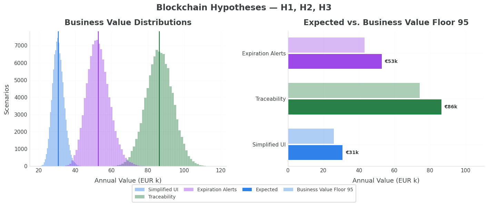
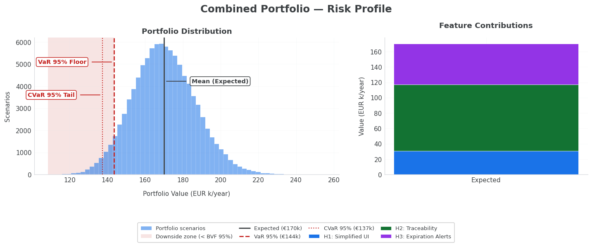
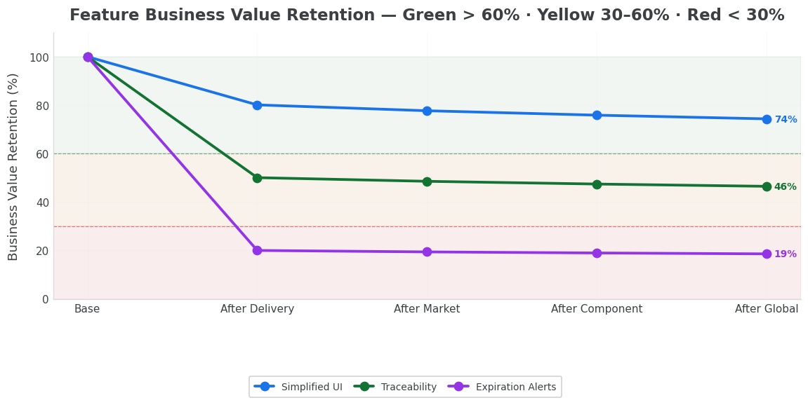
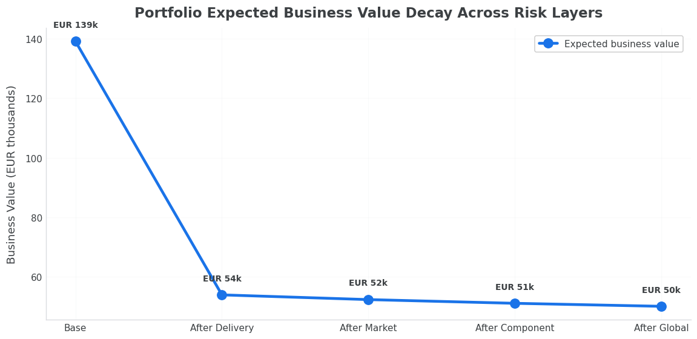
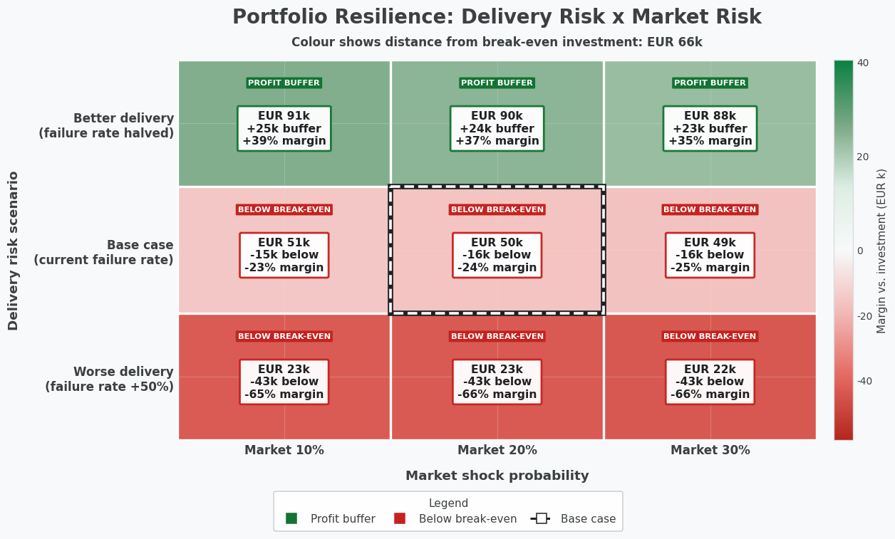

<!--
Project: FHS (Feature Hypotheses Simulation)
Copyright: Eifel42 Stefan Zils 2026
License: See LICENSE and README.md
-->

# The Blockchain Investment Case — Notebooks 01–07 and Advanced

> **Roadmap candidates → board-grade investment evidence.**
>
> A walkthrough of how FHS turns three blockchain feature hypotheses into a defensible roadmap decision: expected business value, margin of safety, tail risk, portfolio resilience, delivery exposure, and a single executive recommendation. Written for Product Owners who must defend a budget, Portfolio Owners who arbitrate trade-offs, Agile leaders who plan capacity, and Risk Managers who sign the governance evidence.

This guide tells the **investment story** behind notebooks [01](apps/fhs/notebooks/01-getting-started.ipynb) through [07](apps/fhs/notebooks/07-blockchain-case-study-decision.ipynb), plus the two advanced portfolio notebooks [A01](apps/fhs/notebooks/advanced/01-portfolio-advisor.ipynb) and [A02](apps/fhs/notebooks/advanced/02-portfolio-risk-dashboard.ipynb). All of them work on a single example: a mid-size agriculture company evaluating three blockchain hypotheses for the next budget cycle. *Should we fund them? Which ones? In what sequence? Against what risk appetite?* Each notebook answers one piece of that question.

For every notebook you get three plain lenses:

- **Why?** — the decision the steering committee must make
- **What?** — the evidence the notebook produces
- **How?** — the method that makes the answer defensible

The guide opens with the **value driver model** that sits underneath every chart, walks through notebooks 01–07, and closes with the advanced track that scales the same framework to a 10-feature portfolio.

---

## The investment thesis — three blockchain hypotheses

Every blockchain notebook (02–07) operates on a single source of truth: [`apps/fhs/notebooks/config/blockchain.yaml`](apps/fhs/notebooks/config/blockchain.yaml). Three hypotheses compete for the same EUR 155,000 budget envelope:

| # | Hypothesis | Strategic intent | Investment | Run-rate p.a. |
|---|---|---|---:|---:|
| **H1** | Simplified UI | Customer retention via UX friction reduction | EUR 75,000 | EUR 25,000 |
| **H2** | Traceability | Premium pricing through end-to-end provenance | EUR 55,000 | EUR 40,000 |
| **H3** | Expiration Alerts | Margin protection via spoilage and chargeback reduction | EUR 10,509 | EUR 3,000 |

**Investment thesis at a glance:**

- **H1 — Simplified UI** is the *operations bet*: modest capex, predictable returns, immediate retention lift. The low-volatility floor builder.
- **H2 — Traceability** is the *premium bet*: largest expected contribution, narrowest distribution, highest forecast confidence. The portfolio anchor.
- **H3 — Expiration Alerts** is the *asymmetric bet*: smallest capex, broadest reach, widest distribution. Optionality with the heaviest delivery exposure.

Each hypothesis is parameterised by three value drivers — the same drivers a Product Owner already controls: **reach**, **adoption**, and **unit value**. From these three numbers, FHS derives every metric on every chart in every notebook.

---

## The value driver model — how business value is built

This section is the keystone of the guide. Once internalised, every chart in every notebook becomes self-explanatory.

### The driver tree (one feature, one fiscal year)

```
              Business Value (EUR p.a.)
                       │
          ┌────────────┼────────────┐
          │            │            │
        Reach      Adoption     Unit Value
       (users)  ×  (rate)     × (EUR per converting unit)
```

```
business_value = expected_users × conversion_rate × business_value_per_conversion
```

Source: [`feature.py` — `get_base_annual_business_value()`](apps/fhs/src/fhs/core/model/entities/feature.py#L198-L208).

Three drivers. Multiplied. That is the entire formula.

### The same model fits three value patterns

The driver tree is deliberately abstract — the same multiplicative structure captures any feature whose value scales with adoption. Three textbook patterns, all native to FHS:

| Value pattern | `expected_users` | `conversion_rate` | `business_value_per_conversion` | Typical investment case |
|---|---|---|---|---|
| **External value** — web-based information systems, e-commerce, marketplaces, SaaS | Addressable buyers reached | Purchase or signup rate | Margin or LTV per converting buyer | A web shop adding a checkout flow |
| **Internal value** — information dashboards, internal services, analytics platforms, automation | Employees or business units exposed | Adoption / utilisation rate | Productivity gain (hours saved × loaded rate) per active user | An ops team rolling out a margin dashboard |
| **Risk avoidance** — compliance controls, fraud rules, incident prevention | Exposure events per year | Prevention / mitigation rate | Cost avoided per prevented event | A fraud-detection rule cutting chargebacks |

A blockchain hypothesis can sit in any of the three patterns. In our case study, **H1 Simplified UI** is the customer-side adoption model, **H2 Traceability** combines premium pricing with brand value, and **H3 Expiration Alerts** is the risk-avoidance flavour. Same formula, three investment narratives.

### Worked example — H2 Traceability

Live values from the YAML, applied to the driver tree:

| Driver | Value | Interpretation |
|---|---:|---|
| `expected_users` | 15,000 | Premium-segment buyers reachable in year 1 |
| `conversion_rate` | 0.18 | 18% of premium buyers act on the provenance signal |
| `business_value_per_conversion` | EUR 32.00 | Incremental margin per converting buyer |
| **Base annual business value** | **EUR 86,400** | Deterministic planning anchor |

This single number is the **planning anchor**, not the decision. A Product Owner who defends "EUR 86k of business value" still has no answer for "what if adoption stalls at 13%?". That is what Monte Carlo simulation is for.

### From point estimate to risk evidence

The simulator runs the **same driver tree 100,000 times**. On every iteration each driver is sampled from a distribution centred on the planning value, with spread set by `uncertainty`:

```
scenario_business_value =
    (expected_users × random_factor)               ← stochastic per scenario
  × (conversion_rate × random_factor)              ← stochastic per scenario
  × business_value_per_conversion                  ← deterministic
```

Output: 100,000 possible business-value outcomes — a full distribution rather than a single number. From that distribution we extract four investment-grade signals:

| Signal | Investment meaning | H2 worked example |
|---|---|---:|
| **Expected business value** | Central forecast — the planning anchor | ~EUR 86k |
| **Business Value Floor 95** | Margin of safety — beaten in 95 of 100 scenarios | EUR 74k |
| **CVaR 95 (tail)** | Stress floor — average outcome in the worst 5% of cases | ~EUR 67k |
| **Spread** | Forecast confidence — narrower = more predictable | tight (uncertainty 25%) |

Together these four numbers replace gut feel with **risk-adjusted decision evidence**.

> **Investment takeaway:** business value = reach × adoption × unit value, simulated across 100,000 futures. The expected value is the forecast; the floor is the margin of safety; the tail is what the firm must underwrite. Every notebook in this guide is a different lens on those four numbers.

---

## Notebook 01 — Getting Started

[`01-getting-started.ipynb`](apps/fhs/notebooks/01-getting-started.ipynb) · 10 min · **prerequisites: none**

### Why?

A Product Owner pitches "we expect 50,000 users at 4% conversion". The steering committee asks: *what if the assumption is off by 20%?* Notebook 01 teaches the answer in one page.

### What?

A first feature simulation in ten minutes. You see the four signals (Expected, Business Value Floor 95, CVaR 95, Spread) for a stand-alone hypothesis, plus a sensitivity analysis showing how the floor moves as uncertainty climbs from 10% to 50%.

### How?

The notebook builds **one** Feature object, runs 10,000 scenarios, and produces the risk dashboard. It then perturbs each driver in turn so you can feel which input dominates the outcome — the calibration step every Product Owner should do before parameterising real candidates.

> **Read this if** FHS is new to you. Skip ahead only if you already speak fluent Business Value Floor.

---

## Notebook 02 — The Investment Case (the heart of the project)

[`02-blockchain-case-study.ipynb`](apps/fhs/notebooks/02-blockchain-case-study.ipynb) · 15 min · **prerequisites: 01**

### Why?

Three blockchain hypotheses compete for one EUR 155k envelope. The Product Owner needs a single deck-ready page that answers: *which hypothesis carries the strongest value contribution, which carries the most downside, and what is the optimal portfolio mix?*

### What?

A complete board-grade comparison of H1, H2, H3 — full distributions, downside floors, combined portfolio profile, and a recommended sequencing plan.



*Three histograms on the left = the 100,000 simulated business-value outcomes per hypothesis. The dark bars on the right = each feature's Business Value Floor 95 in EUR. Reading: H2 Traceability is the strongest single contributor (EUR 86k expected, EUR 74k floor, narrow distribution → high forecast confidence). H3 Expiration Alerts is mid-size (EUR 53k expected) but the widest spread — uncertainty 35%, the assumption with the most validation debt. H1 Simplified UI is the smallest and most predictable bet — the volatility-dampening leg of the portfolio.*



*Left: the three-feature portfolio (EUR 170k expected, EUR 144k floor, EUR 137k CVaR tail). Right: each hypothesis' contribution to total expected value — H2 dominates the stack. Investment narrative: "we underwrite EUR 170k of expected annual value, with a margin of safety of EUR 137k even in the worst 5% of futures. Against EUR 68k of run-rate operating cost, that leaves EUR 102k of contribution before financing the EUR 140k capex."*

### How?

The notebook loads the YAML scenario, simulates each feature plus the combined portfolio, and produces the histograms above plus a per-feature ranking. An interactive **Configuration Form** lets stakeholders adjust assumptions live — every downstream notebook re-reads the YAML and adopts the change.

> **Read this if** you want to see the full investment workflow on real data. This is the demo notebook for steering committee reviews.

---

## Notebook 03 — Capital Budgeting (NPV, IRR, financing)

[`03-blockchain-case-study-capital-budgeting.ipynb`](apps/fhs/notebooks/03-blockchain-case-study-capital-budgeting.ipynb) · 15 min · **prerequisites: 02**

### Why?

Notebook 02 said "H2 has the strongest value contribution". But H2 needs cash today and pays back over years. NPV asks: *after discounting future cash flows to present value, is each feature still accretive to firm value?* IRR asks: *does the project clear our hurdle rate?* And the financing question is: *upfront or amortised?*

### What?

Side-by-side NPV, IRR, and Profitability Index per feature, the verdict against a 12% hurdle rate, and a financing comparison (upfront capital outlay versus three-year instalments).

| Term | Investment meaning |
|---|---|
| **NPV** | Present value of future cash flows minus today's investment — the value created by the project |
| **IRR** | The discount rate at which NPV = 0 — the project's intrinsic yield |
| **Hurdle rate** | The minimum acceptable IRR (cost of capital). YAML default: 12% |
| **Profitability Index** | NPV / Investment — the value-per-EUR ranking metric for capital rationing |

### How?

For each feature the notebook converts the Monte Carlo distribution into a multi-year cash-flow profile, applies the discount rate, and computes NPV and IRR. Instalment financing splits the investment over `installment_years` (in our YAML: H1 over 3 years, H3 over 2). The methodology is straight from any corporate-finance textbook — translated to feature-level granularity.

> **Read this if** the finance partner asks "is this a value-creating investment, not just a profitable feature?". NPV and IRR are the lingua franca of capital allocation.

---

## Notebook 04 — Portfolio Advisor (capital allocation under constraint)

[`04-blockchain-case-study-advisor.ipynb`](apps/fhs/notebooks/04-blockchain-case-study-advisor.ipynb) · 15 min · **prerequisites: 03**

### Why?

Per-feature NPV is necessary but not sufficient. Real portfolios are picked as **bundles** under a budget cap. The advisor answers: *given EUR 155k, which subset of features maximises total value contribution?*

### What?

An ILP-based optimiser that evaluates every legal feature combination, returns the value-maximising selection, and stress-tests it across budget levels (50%, 75%, 100%) and planning horizons (1, 3, 5 years).

### How?

The notebook formulates the selection as an integer linear program: choose features such that aggregate investment ≤ budget, maximising aggregate NPV. It then benchmarks the ILP solution against simpler heuristics (greedy by NPV, exact enumeration) so the steering committee can see why ILP is the dominant strategy at scale.

> **Read this if** you have more candidate features than capital. The advisor reduces the budget conversation from "feeling" to a constrained optimisation with a single, defensible answer.

---

## Notebook 05 — Risk Dashboard (portfolio resilience)

[`05-blockchain-case-study-risk.ipynb`](apps/fhs/notebooks/05-blockchain-case-study-risk.ipynb) · 15 min · **prerequisites: 02**

### Why?

So far the lens has been "what we expect to earn". The risk officer asks the dual question: *what survives delivery slippage, a 30% market correction, a key-component failure, and a global shock — compounded, not single?*

### What?

A risk-attribution waterfall that strips portfolio value layer by layer, plus a 3×3 stress matrix (delivery risk × market shock probability) for board-level scenario reviews.



*Each line = one hypothesis. Y-axis = % of business value remaining after each successive risk layer. H1 retains 74% (green = robust). H2 retains 46% (yellow = monitor). H3 retains only 19% (red = action required). H3 carries the widest forecast distribution **and** the weakest delivery resilience — exactly the cross-cutting insight no spreadsheet delivers.*



*Same analysis at portfolio level. Base case EUR 139k → after delivery risk EUR 54k → after market shock EUR 52k → after global shock EUR 50k. Delivery is the dominant risk factor (−61%); market, component, and global shocks add only marginal additional drag. The lever to pull is delivery quality, not market hedging.*



*The most uncomfortable chart in the entire guide — and the most actionable. Break-even threshold: EUR 66k/year (operating cost). Base case (dashed border): EUR 50k — **EUR 16k below break-even**. Halve the delivery failure rate and the cell flips to a EUR 24k profit buffer. **The decision lever is delivery excellence, not external hedging.** This single chart converts a "we should probably ship faster" instinct into a quantified, EUR-denominated investment mandate.*

### How?

The simulator chains four independent risk layers (delivery → market → component → global) and applies each to the value distribution. The matrix re-runs the simulation across nine combinations of delivery and market parameters. The methodology mirrors the layered VaR approach used in institutional risk management — applied to product-backlog economics.

> **Read this if** governance, risk, or audit asks "show me the downside, not the upside". This is the notebook that makes the answer institutionally defensible.

---

## Notebook 06 — Delivery Risk (the EUR cost of slippage)

[`06-blockchain-case-study-delivery-risk.ipynb`](apps/fhs/notebooks/06-blockchain-case-study-delivery-risk.ipynb) · 15 min · **prerequisites: 02**

### Why?

Delivery is one of the few risks Product Owners directly influence. The board does not care that a feature slipped a sprint — it cares about the **EUR cost** of the slip. *What is the break-even probability per feature? What is the expected loss conditional on failure? What is the unrecoverable capital if a project is killed mid-flight?*

### What?

Four delivery-risk metrics per feature, all in EUR:

| Metric | Investment meaning |
|---|---|
| **Break-even probability** | Of 100 simulated deliveries, how many produce positive net contribution? |
| **Expected loss** | Average loss conditional on a loss-making outcome |
| **Loss at Risk (LaR 95%)** | "In the worst 5% of deliveries we forfeit at least this much" — a one-sided VaR |
| **Sunk cost at cancellation** | Capital already deployed and unrecoverable if the project is killed |

### How?

The notebook simulates delivery at sprint granularity: each sprint either lands on time, slips, or triggers cancellation. Annual business value from notebook 02 is multiplied by a delivery-success factor per scenario. The result is a profit distribution per feature, from which the four metrics are derived. The sunk-cost arithmetic is the same logic auditors use to challenge "good money after bad" investments.

> **Read this if** you set sprint-review gating criteria. Use the sunk-cost number to define the kill threshold *before* the project starts: "if cancellation after Sprint 4 costs EUR X, agree the kill criterion in Sprint 0 — not Sprint 5".

---

## Notebook 07 — Executive Decision (the verdict on one page)

[`07-blockchain-case-study-decision.ipynb`](apps/fhs/notebooks/07-blockchain-case-study-decision.ipynb) · 10 min · **prerequisites: 02–06**

### Why?

Notebooks 02 through 06 produce five separate views: business value, financial return, portfolio fit, risk profile, delivery cost. A steering committee does not have time to read five notebooks. They need *one* page that answers a single question: **GO, conditional GO, or REVIEW?**

### What?

A board-ready synthesis with five investment dimensions on one panel, plus a traffic-light recommendation and a phased rollout proposal:

| Dimension | Source notebook | What it carries into the decision |
|---|---|---|
| **Business Value** | NB 02 | Expected business value, downside floor, CVaR tail per feature |
| **Financial Return** | NB 03 | NPV, IRR, Profitability Index, hurdle-rate verdict |
| **Portfolio Optimisation** | NB 04 | Best feature bundle under budget, value-floor vs. NPV strategy comparison |
| **Risk Profile** | NB 05 | Layered risk waterfall, delivery as the dominant lever |
| **Delivery Cost Risk** | NB 06 | Break-even probability, expected loss, sunk cost at cancellation |

The notebook closes with a **phased rollout plan** (which feature first, which gate to pass before the next one starts) and a **what-if quick check** that re-runs the recommendation under three robustness scenarios.

### How?

Each dimension is computed by calling the same services the upstream notebooks use — no duplicated logic. The traffic-light derivation is encoded in two value objects, [`ExecutiveDecisionResult` and `DecisionDimension`](apps/fhs/src/fhs/core/model/value_objects/executive_decision.py), so the rule book is auditable rather than hand-tuned per slide. The output is a single decision card per feature plus a portfolio-level recommendation.

> **Read this if** you have one slot on a steering-committee agenda and need to defend the recommendation in five minutes. This is the closing slide for the investment case.

---

## Advanced track — same framework, ten features

The core track (01–07) operates on three feature hypotheses. Real portfolios carry ten or more. The advanced track applies the **same framework** at portfolio scale — same value driver tree, same four signals, same risk layers — and adds the institutional-grade metrics that only become meaningful at scale.

> **Methodological identity:** the mathematics is identical to the core track. The conversation widens. Anything you learned in 01–07 transfers.

### A01 — Portfolio Advisor (10 features, three solvers)

[`advanced/01-portfolio-advisor.ipynb`](apps/fhs/notebooks/advanced/01-portfolio-advisor.ipynb) · 20 min · **prerequisites: 04**

#### Why?

Notebook 04 picked the best bundle from three candidates. With ten candidates the search space explodes from 8 combinations to 1,024. A Portfolio Owner asks: *which 10-feature subset maximises business-value floor under EUR 1.5M, and how concentrated is the resulting portfolio?*

#### What?

Three deliverables on one notebook:

1. **Feature ranking** — every candidate scored on expected value, Business Value Floor 95, and delivery exposure. The ranking surfaces both the *anchors* (high floor, low spread) and the *speculative* features (high expected value, weak floor).
2. **Solver comparison — ILP vs Exact vs Greedy.** Exact enumerates every legal subset (the quality benchmark, slow at 10+ features). ILP solves the same problem with a mathematical programming model (typically same answer, orders of magnitude faster). Greedy adds features one by one by score (fastest, but can miss the optimum). The comparison gives the steering committee evidence-based confidence in the ILP recommendation.
3. **Concentration risk via HHI** (Herfindahl-Hirschman Index) — the institutional standard for detecting "single-bet" portfolios. Below 0.25 = diversified, 0.25–0.40 = monitor, above 0.40 = structural warning. Two portfolios with identical NPV can carry very different HHI; the advisor flags the difference before capital is committed.

#### How?

The optimiser sets up the integer linear program once (`maximise floor of combined Monte Carlo distribution s.t. Σ investment ≤ budget`), then runs all three solvers on the same scenarios array so the comparison is apples-to-apples. The HHI is computed on the optimal bundle's expected-value shares. Stress tests at 50% / 75% / 100% of budget reveal whether the recommendation is robust to a budget cut.

> **Read this if** capital rationing is a real constraint and the candidate list is longer than five. The notebook converts a multi-day spreadsheet exercise into a 20-minute defensible recommendation.

### A02 — Portfolio Risk Dashboard (resilience under combined shocks)

[`advanced/02-portfolio-risk-dashboard.ipynb`](apps/fhs/notebooks/advanced/02-portfolio-risk-dashboard.ipynb) · 20 min · **prerequisites: 05, A01**

#### Why?

Notebook 05 showed the layered risk view on three features. At ten features the picture changes: some features hedge each other, others move together. A CFO asks: *if we under-fund this portfolio at 25% or 50% of plan, what value remains, and what tail risk does the residual carry?*

#### What?

Three institutional-grade views on the optimised portfolio:

1. **Risk layers L1 / L2 / L3** — market shock (L1), delivery failure (L2), crisis stress (L3) — applied sequentially to the combined distribution. Each layer reports the EUR drop, the surviving floor, and the dominant feature contribution. This is the chart that answers "what gets eaten first".
2. **Likelihood-of-non-delivery (LLP) impact** — every feature carries a probability of not being delivered at all. Combining ten features compounds the LLP. The dashboard shows the expected portfolio outcome under Bernoulli delivery sampling, side-by-side with the deterministic forecast. The gap between the two is the *delivery premium* the portfolio must absorb.
3. **Budget risk path** — portfolio outcomes at 25% / 50% / 100% of full investment. The path reveals the *non-linearities*: at 50% of budget the optimiser may drop the highest-floor feature, collapsing the diversification benefit. The CFO conversation becomes "here is the cliff edge", not "here is the average".

#### How?

The notebook runs the optimised portfolio through the layered risk simulator for each budget level, then aggregates per-layer EUR drops into a single waterfall. LLP sampling adds a Bernoulli stage on top of the value distribution per feature. Stress scenarios (single-feature failure, top-2 simultaneous failure, market + delivery combined) are explicit columns in the same output table — so a board reviewer can compare them at a glance.

> **Read this if** you must defend the portfolio against governance, risk, or audit. The output is the chart pack a Risk Manager signs off on before the capital request goes upstairs.

**Shared dataset:** A01 and A02 use the same `advanced-features.yaml` scenario, schema-validated via `scenario_schema.json`. Edit once, both notebooks adopt the change.

**Recommended flow:** A01 selects the bundle. A02 stress-tests it. Open them in that order.

---

## Decision flow — the executive cheat sheet

```
┌─────────────────────────────────────────────────────────────────────────┐
│  FHS INVESTMENT WORKFLOW                                                │
├─────────────────────────────────────────────────────────────────────────┤
│                                                                         │
│   1. Frame the hypothesis     →  3 value drivers in YAML                │
│      (reach × adoption × unit value)                                    │
│                                                                         │
│   2. Run the simulation       →  100,000 scenarios                      │
│      (notebooks 01, 02)                                                 │
│                                                                         │
│   3. Read 4 signals           →  Expected · Floor 95 · CVaR · Spread    │
│      (notebook 02)                                                      │
│                                                                         │
│   4. Apply the capital lens   →  NPV · IRR · Profitability Index        │
│      (notebook 03)                                                      │
│                                                                         │
│   5. Optimise the portfolio   →  ILP under budget constraint            │
│      (notebooks 04, A01)                                                │
│                                                                         │
│   6. Stress-test resilience   →  Layered risk + scenario heatmap        │
│      (notebooks 05, A02)                                                │
│                                                                         │
│   7. Set delivery gates       →  Break-even probability + sunk cost     │
│      (notebook 06)                                                      │
│                                                                         │
│   8. Synthesise the verdict   →  Five dimensions, one traffic light     │
│      (notebook 07)                                                      │
│                                                                         │
└─────────────────────────────────────────────────────────────────────────┘
```

### When the boardroom asks…

| Question | Open |
|---|---|
| *"Is this hypothesis investable at all?"* | [01](apps/fhs/notebooks/01-getting-started.ipynb) |
| *"Compare the three blockchain options on one slide."* | [02](apps/fhs/notebooks/02-blockchain-case-study.ipynb) |
| *"Does the IRR clear our cost of capital?"* | [03](apps/fhs/notebooks/03-blockchain-case-study-capital-budgeting.ipynb) |
| *"Given EUR 155k, what is the value-maximising bundle?"* | [04](apps/fhs/notebooks/04-blockchain-case-study-advisor.ipynb) |
| *"What survives a market correction and a delivery miss?"* | [05](apps/fhs/notebooks/05-blockchain-case-study-risk.ipynb) |
| *"What does a sprint slip cost us in EUR?"* | [06](apps/fhs/notebooks/06-blockchain-case-study-delivery-risk.ipynb) |
| *"GO or no-go, on one page?"* | [07](apps/fhs/notebooks/07-blockchain-case-study-decision.ipynb) |
| *"At full portfolio scale (10 features)?"* | [A01](apps/fhs/notebooks/advanced/01-portfolio-advisor.ipynb) · [A02](apps/fhs/notebooks/advanced/02-portfolio-risk-dashboard.ipynb) |

---

## Next moves

- **Run it.** Install via [README.md](README.md) (10 minutes). Open [01-getting-started.ipynb](apps/fhs/notebooks/01-getting-started.ipynb).
- **Re-frame the hypothesis.** Edit [`blockchain.yaml`](apps/fhs/notebooks/config/blockchain.yaml). One value, all notebooks update.
- **Defend the framework.** [BEGINNERS_GUIDE.md](BEGINNERS_GUIDE.md) for end-to-end methodology, [GLOSSARY.ipynb](apps/fhs/notebooks/GLOSSARY.ipynb) for term definitions.

> *Disclaimer: FHS is a prototype. Simulation outputs are decision-support, not investment advice. Validate before committing capital.*
